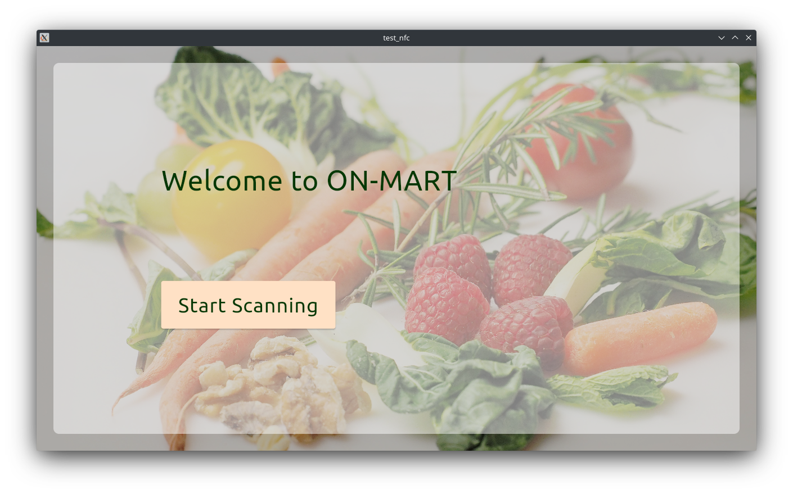
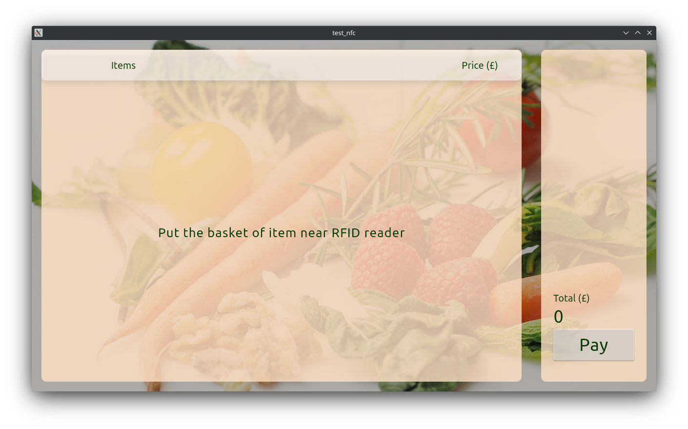
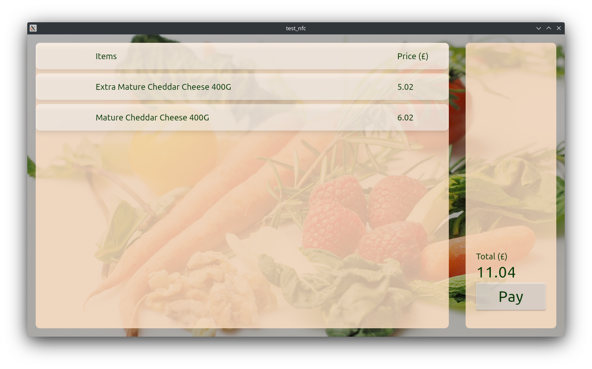
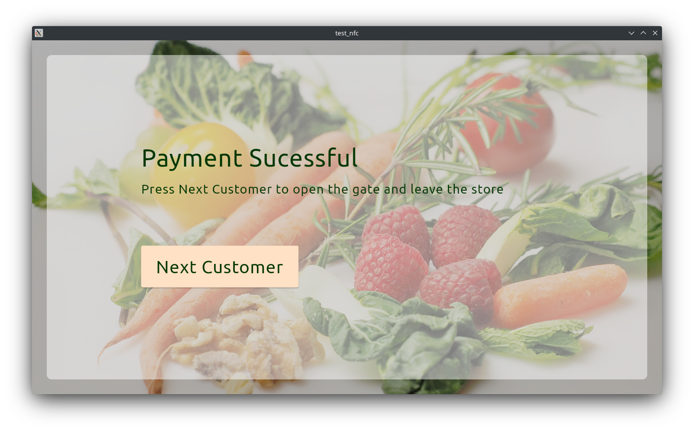

# Device GUI

This section is the GUI of the system prototype. This application was design to be deployed in the linux system on the edge device. As the RFID reader is expensive, NFC technology was implemented as the proof of concept.

## Getting Started
A few resources to get you started the Flutter project:

- [Lab: Write your first Flutter app](https://docs.flutter.dev/get-started/codelab)
- [Cookbook: Useful Flutter samples](https://docs.flutter.dev/cookbook)

## env
after clone the project, do not forget to change .env.format to .env and .env.production (for production code) by changing the sample .env.format to the actual value.

## linux command for nfc reader
In case the NFC reader does not work properlly, we can use these command to 
`sudo systemctl restart pcscd.socket`
`pcsc_scan`

## updating the model class
for create model.g.dart file 
`flutter pub run build_runner build`

## deployment
This application can be deployed on the edge computing device which used linux system by by following this [online documentation](https://docs.flutter.dev/platform-integration/linux/building).
.

## UI
The UI of the app is shown below

